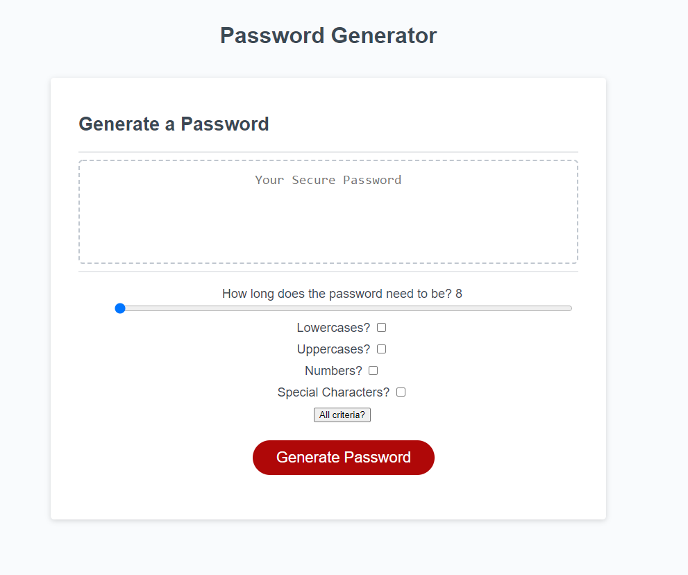

# Password Generator

- This app generates a secure password for the user that includes all the requirements set by the user. 
- Currently learning how to manipulate the DOM
- Copies the password to clipboard automatically

## Running the app

1. Simply visit this link!
[Github Pages Link](https://tevissaur.github.io/visiting-friends/)

## How to use the app

1. Select all requirements
2. Click "Generate Password"
3. ???
4. Profit!

## Layout

## Thoughts
The requirements for the project were to prompt the user to specify a length for the password, and to ask the user for the specific character sets the user wants to include into the randomly generated password. Since I am currently learning about the DOM I decided to incorporate that into my project. I created elements in the DOM to prompt the user, and learned a great deal about how to parse throught DOM objects and get the desired data. Each checkmark's boolean value is evaluated and if it is selected, the generatePassword() function adds in the appropiate character set into the possible characters to select from. The data structure I used to store all relevant information was an object. I find that objects are nice data structures to store related values, and utilized them. However, I don't think I am using them correctly yet, soon enough I will learn how to create objects the right way.
